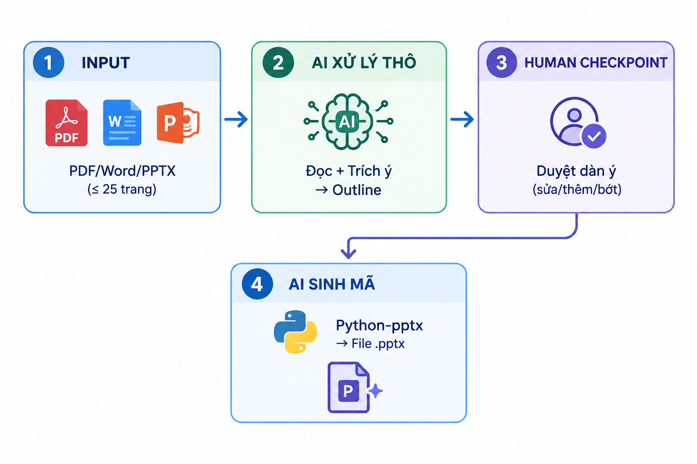

# AI Capstone Project — Tự động sinh Slide PowerPoint từ Báo cáo Khoa học

> **Hệ thống AI đọc tài liệu (PDF/Word/PPTX) → trích xuất nội dung cốt lõi → sinh mã Python (python-pptx) để tự động tạo bài thuyết trình chuyên nghiệp.**

---

## 🎯 1. Bài toán

Sinh viên và nghiên cứu sinh mất rất nhiều thời gian để chuyển một bài báo cáo/bài báo khoa học thành slide thuyết trình. Quy trình thủ công gồm 10 bước, trong đó **2 điểm nghẽn lớn nhất** là:

1. **Chắt lọc nội dung** — đọc tài liệu dài, xác định đâu là ý chính.
2. **Thiết kế & phân bổ nội dung** — chọn template, bố cục, căn chỉnh, đảm bảo đồng nhất.

## 💡 2. Giải pháp

AI đóng vai trò **Chuyên gia Phân tích Dữ liệu & Thiết kế Trình chiếu**, thực hiện:

- Đọc tài liệu đầu vào (tối đa 25 trang).
- Trích xuất 5–7 ý chính/slide, **không bịa đặt** (No Hallucination).
- Đề xuất dàn ý → **Human Checkpoint** (người dùng duyệt/sửa).
- Sinh mã **Python (python-pptx)** để tạo file `.pptx` với font Unicode chuẩn.

## 🏗️ 3. Kiến trúc luồng (Workflow)
  



## 📂 4. Cấu trúc thư mục
```text
AI-Prototype-for-creating-PowerPoint-slides/
├── README.md
├── docs/
│ ├── system-design.md
│ ├── workflow-diagram.png
│ └── limitations-safety.md
├── instructions/
│ ├── system-prompt-v1.md
│ └── system-prompt-v2.md
├── evals/
│ ├── test-cases.csv
│ └── failure-analysis.md
└── demo/
└── sample-inputs/
```

## 🚀 5. Hướng dẫn chạy nhanh

1. **Chuẩn bị:** Python ≥ 3.9, cài đặt `python-pptx`:
   ```bash
   pip install python-pptx
Nạp System Prompt V2 (instructions/system-prompt-v2.md) vào LLM.

Upload tài liệu (PDF/Word/PPTX ≤ 25 trang).

Duyệt dàn ý do AI đề xuất.

Nhận mã Python → chạy để sinh file .pptx.

## 📊 6. Kết quả đánh giá
Phiên bản	Tỉ lệ pass (10 kịch bản)	Kịch bản fail
V1	20%	#2,3,4,5,6,7,9,10
V2	90%	#10 (font toán học)

## 📚 7. Tài liệu liên quan
Thiết kế hệ thống 11 thành phần

Phân tích thất bại & bài học

Khuyến cáo an toàn

---

